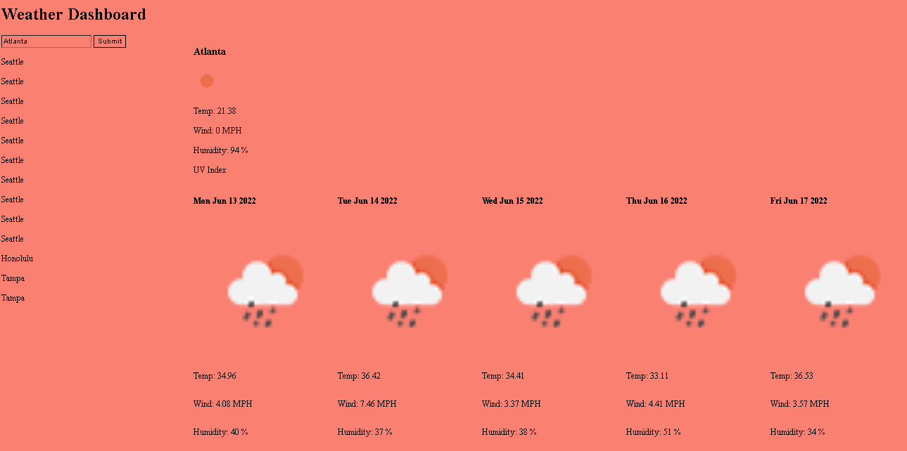

# 06-weatherdashboard
assignment 6

## Objective

For this assignment, our task was to build a weather app that could successfully utilize API calls, as well as save data to Local Storage

This assignment was intended to prepare us for our first project, to better familiarize us with making API calls.

## Requirements 

```
GIVEN a weather dashboard with form inputs
WHEN I search for a city
THEN I am presented with current and future conditions for that city and that city is added to the search history
WHEN I view current weather conditions for that city
THEN I am presented with the city name, the date, an icon representation of weather conditions, the temperature, the humidity, the wind speed, and the UV index
WHEN I view the UV index
THEN I am presented with a color that indicates whether the conditions are favorable, moderate, or severe
WHEN I view future weather conditions for that city
THEN I am presented with a 5-day forecast that displays the date, an icon representation of weather conditions, the temperature, the wind speed, and the humidity
WHEN I click on a city in the search history
THEN I am again presented with current and future conditions for that city
```

## My App

As shown below, my app uses a search bar as an input field to get data from the user.  It will then call the API with the given Data and fetch data for weather information for the desired city.  From there, my app makes a second API call to fetch a new set of data for a 5-day forecast.



## My Links

[Repo](https://github.com/KIMOISQUIGGLES/06-weatherdashboard)

[App](https://kimoisquiggles.github.io/06-weatherdashboard/)